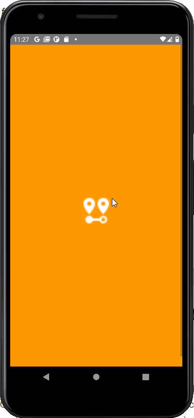

# geo-tape  (ReactNative🔯) 

Geo Tape is an Android Mobile application that let's you calculate the distance between two GPS coordinates! It uses random/mock locations and can persist user data when not in use. 

### Technologies and Libraries Used
- React Native version 0.68.0
- React version 17.0.2
- Radom Location version 1.1.3 [docs](https://github.com/rmrs/random-location)
- Redux version 4.0.5 and React Redux version 7.2.1
- Android Studio

## Instructions
### 1. Running the application
1. Ensure that you have [Node.js](https://nodejs.org/en/) installed and Have Set Up Android Studio as shown [here](https://reactnative.dev/docs/environment-setup)
2. Clone the application repository from Github using the command below in your terminal:
&nbsp; `$ git clone https://github.com/StephenAraka/geo-tape.git`
3. Change directory into the app folder:
&nbsp; `$ cd geo-tape`
4. Install the application's dependencies:
&nbsp; `$ npm install`
5. Run the application (Android):
&nbsp; `$ react-native run-android`
6. This will open your Android Studio emulator where the app should be running

_Below are some screenshots of screens from the running application:_
| Splash Screen      | Main Screen | Main Screen  (list)| New Measurement Screen |
| ----------- | ----------- | ----------- | ----------- |
|       |        |        |  |

_Below is a demo of the application:_

## Recommended improvements
- While the application is almost complete, The 'Edit' feature is not. But the Redux Reducer and Action for it are written already. Given more time, I would implement this functionality.
- Get GPS inputs in different formats, and Locations (... and probably use a map)
